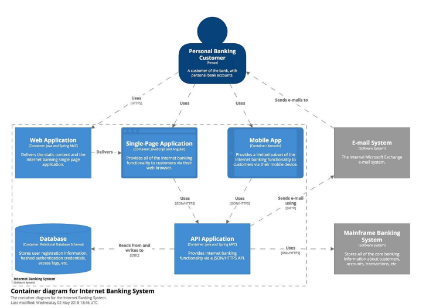

# Patrones de arquitectura - Clase 1 - 2025

## Rol del arquitecto 
El arquitecto trabaja sobre la "big picture" del sistema, no en los detalles específicos de cada componente (base de datos, cliente, backend). Debe tener una visión global, incluyendo funcionalidades futuras del sistema. Las decisiones del arquitecto son estratégicas y difíciles y costosas de cambiar a futuro.
Se encarga de trabajar en lo conceptual, en las interfaces en lugar de las implementaciones.
Debe satisfacer los requerimientos no funcionales (performance, seguridad, escalabilidad, etc.). Balancea los diferentes requerimientos no funcionales, ya que optimizar uno puede afectar negativamente a otros.

Se ve al arquitecto como aliado del desarrollador, como líder técnico, en cualquier caso se trata de diseñar:
- **Diseño y estructura de los componentes**: Definir módulos principales y su interacción.
- Selección del patrón arquitectónico: Elegir patrones como MVC, cliente-servidor, microservicios, dependiendo de los requerimientos.
- **Toma de decisiones técnicas clave**: Selección de tecnologías y frameworks, definición de protocolos de comunicación (TCP, HTTP, colas asíncronas, etc.), y estructura y manejo de datos y almacenamiento. O comunicación entre los miembros del equipo y stakeholders.
- Cumplimiento de requerimientos no funcionales: Escalabilidad, seguridad, mantenibilidad, disponibilidad, etc. 
- Integración con otros sistemas: APIs, sistemas legados, terceras partes. Requiere definir cómo se comunicarán y cómo se trabajarán los datos.
- Evolución y mantenimiento del sistema: Planificar futuras mejoras y migraciones. Un buen diseño facilita la inclusión de cambios sin necesidad de retestear todo el sistema.

¿Es necesaria la arquitectura del software? 
- Mejora la comunicación entre los miembros del proyecto y con los stakeholders.
- Representa un modelo del sistema que facilita la discusión y la toma de decisiones sobre cambios.
- Reduce costos de desarrollo y mantenimiento al facilitar la introducción de cambios.
- Mejora la calidad del software (potencialmente acelerando el desarrollo con calidad).
- Facilita la colaboración entre equipos al definir claramente los componentes y sus responsabilidades.
- Permite adaptarse a los cambios en los requerimientos y en las tecnologías al tener el sistema modularizado. 

## Modelo de arquitectura C4
Se encarga de diagramar la arquitectura en 4 capas donde describe los componentes 
Los cuatro niveles que describe el modelo C4 son:
- **Contexto del sistema**: Muestra el sistema en relación con sus usuarios y otros sistemas externos con los que interactúa.
- **Contenedores**: Realiza un zoom dentro del sistema, mostrando los contenedores principales (aplicaciones, bases de datos, microservicios, etc.) y cómo se relacionan entre sí.
- **Componentes**: Los componentes del sistema como Web Application, Single-Page Application, Mobile App...
- **Código**: Opcionalmente, puede incluir diagramas de clases o de secuencia para detallar la implementación de los componentes.

El modelo C4 permite tener una visión estructurada de cómo está dividida la aplicación, lo que facilita la organización del equipo de desarrollo, asignando responsabilidades a diferentes personas o equipos para trabajar en distintas partes. Además, al utilizar una representación visual con "cajitas modulares" (aplicación móvil, aplicación web, backend), facilita la comunicación con personas que no son tan técnicas, como los stakeholders o clientes.

> If you think good architecture is expensive, try bad architecture. 