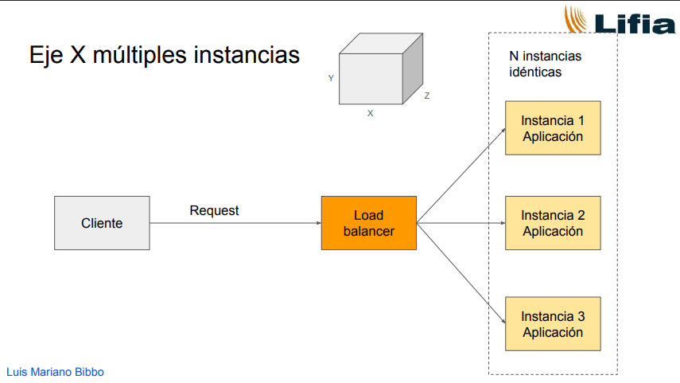
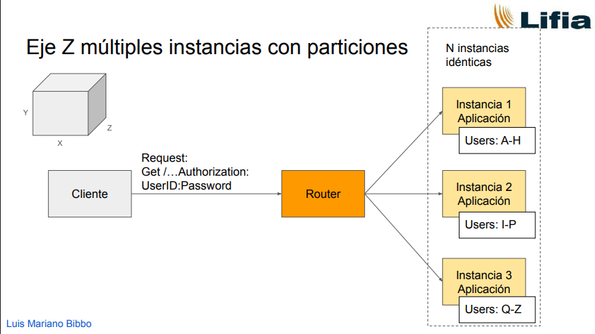
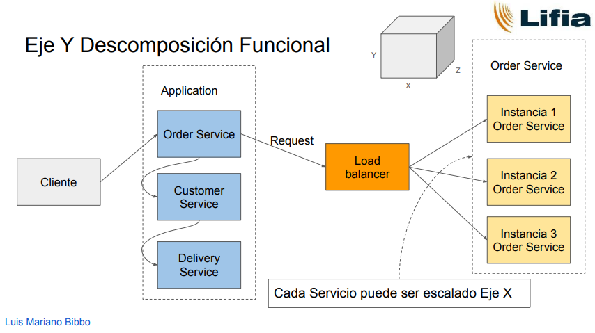
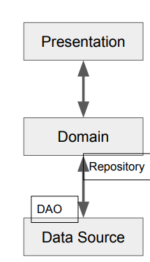

# Patrones de arquitectura - Clase 4: Eficiencia y performance

> Referencia: [Video de Youtube](https://www.youtube.com/watch?v=NEb_kuYvzhE&ab_channel=LuisMarianoBibb%C3%B3)
> Bibliografía mencionada: _Patterns Of Enterprise Application Architecture_, Martin Fowler.

## Medición de variables
- **Response time**:  Es el tiempo del sistema en procesar una petición del exterior. Puede tratarse de una acción de la interfaz de usuario o de una llamada a la API del servidor. 
- **Responsiveness**: Rapidez con la que el sistema acusa recibo de una solicitud (dar feedback al usuario). Un buen responsiveness puede mejorar la percepción de performance aunque el response time no sea óptimo.
> Si el response time es malo no duele tanto si el responsiveness es bueno. 
- **Latencia**: Tiempo mínimo necesario para obtener algún tipo de respuesta. No se puede mejorar una vez instalado el sistema y depende de la distancia física entre componentes. La latencia alta deteriora el response time. Se deberín minimizar las llamadas remotas. 
- **Throughput**: Cantidad de trabajo que el sistema puede hacer en un tiempo determinado (ej: transacciones por segundo - tps).
- **Performance**: Desde el punto de vista del usuario, puede ser throughput o response time. Es una medida relativa a lo que hace el sistema y lo que espera el usuario. Mejorar la responsiveness puede mejorar la performance percibida. 
- **Load**: Medida de la carga del sistema (ej: número de usuarios atendidos). Se relaciona con el response time para evaluar la capacidad.
- **Load Sensitivity (Degradation)**: Indica cómo varía el response time a medida que aumenta la carga.
- **Efficiency**: Performance dividida por los recursos utilizados (ej: 30 tps con 2 CPUs).
- **Capacity of a System**: Máximo throughput o load que el sistema puede manejar antes de que el rendimiento caiga por debajo de un umbral aceptable. Relaciona lo que se puede hacer con un tiempo aceptable.
- **Scalability**:  mide cómo se ve afectada la performance al agregar o quitar recursos (generalmente hardware). Es clave diseñar sistemas que faciliten el escalamiento. Ejemplo: más servers o el mismo server con más memoria. 

### Escalamiento 
Hay tres ejes o estrategias principales de escalamiento:
- **Eje X (Duplicación)**: Consiste en duplicar instancias idénticas de la aplicación detrás de un balanceador de carga (Load Balancer). Es como poner nuevos servidores con la misma aplicación. Dificultades: gestionar el estado de la sesión y posibles cuellos de botella en la base de datos si es compartida.

- **Eje Z (Particiones)**: Consiste en dividir las peticiones o los datos y dirigirlos a instancias idénticas utilizando un enrutador (Router). Por ejemplo, particionar usuarios por rango (A-H, I-P, Q-Z). Requiere que parte de la lógica (como autenticación) se mueva al enrutador. Las instancias siguen siendo monolíticas.

- **Eje Y (Descomposición Funcional)**: Consiste en dividir la aplicación monolítica en servicios distintos o microservicios, cada uno atendiendo una funcionalidad específica. Cada servicio puede ser escalado de forma independiente en el eje X (replicando instancias del servicio). Esta estrategia, combinada con el escalamiento en X por servicio, es la que se busca mejorar en la materia. Herramientas como Kubernetes pueden automatizar el escalamiento de servicios basado en métricas.

## Patrones de Arquitectura de Software 
**Qué es un pattern?** Describe un problema recurrente y ofrece el núcleo de una solución probada, adaptable a diferentes contextos, y se conecta con otros patrones formando un "lenguaje".
Los **Design Patterns** adaptan este concepto al diseño de software orientado a objetos: una solución reutilizable a un problema común, no es código copy-paste sino un modelo conceptual para resolver un problema específico de manera flexible y mantenible.

### Layering
Consiste en organizar el software en capas. La comunicación debe fluir en un orden específico, generalmente hacia abajo, evitando saltar capas.

## Client - Server
Un patrón fundamental donde un Cliente (generalmente con la UI) interactúa con un Server (como la base de datos). Surge la pregunta sobre dónde ubicar la lógica de dominio y las validaciones. 

## The Three Principal Layers 
Muchas aplicaciones web se organizan al menos en estas tres capas principales:
- Presentation: La interfaz de usuario (puede ser HTML, línea de comandos).
- Domain: Contiene la lógica del negocio/dominio.
- Data Source: Se encarga de la comunicación con la base de datos.

### Estrategias para la capa de dominio (domain layer)
- **Transaction Script**: Cada operación o transacción del usuario se maneja con un procedimiento único que interactúa directamente con la base de datos. Hay pocos o ningún objeto de dominio con comportamiento. Es muy orientado a la base de datos.
- **Table Module**: Una clase (o singleton) maneja toda la lógica y funcionalidad relacionada con una única tabla de la base de datos. Tampoco se centra en objetos individuales de dominio. 
- **Domain Model**: Enfoque orientado a objetos donde los conceptos del dominio se representan como objetos con datos y comportamiento. La lógica de negocio reside en estos objetos y sus interacciones. La complejidad del código crece de manera más constante a medida que se añade funcionalidad, a diferencia de Transaction Script o Table Module, cuya complejidad puede crecer exponencialmente. Facilita el uso de principios OO como el polimorfismo.

### Service Layer
Fowler presenta una capa adicional a la de las tres capas, ubicada entre la capa de presentación y la capa de dominio. 
Expone la funcionalidad del modelo de dominio como un conjunto de operaciones llamadas servicios. Cada servicio coordina la operación correspondiente. Es una capa funcional.
**Ventajas:**
- Expone claramente la funcionalidad del backend.
- Los clientes no quedan atados a la implementación subyacente del dominio.
- Separa el diseño de la lógica de los aspectos de interfaz gráfica.
- Se pueden tener múltiples clientes para los mismos servicios, usando
diferentes protocolos y formatos.
-  Proveer una interfaz más “accesible” que la del modelo de dominio, evitando problemas de performance por excesivas invocaciones de cliente a servidor.
**Desventajas**:
- Un cambio en la capa de servicios puede implicar varios cambios en otras capas (Dominio, Datos).
- Posibles problemas de performance debido a las llamadas adicionales entre capas, aunque se considera que tener las capas separadas facilita saber dónde modificar.

### Database Layer - Persistencia
Se encarga del mapeo del modelo de dominio a la fuente de datos, típicamente una base de datos relacional (usando ORM como JPA/Hibernate) o NoSQL.
**Problemas:**
- Mucha interacción con la DB por cada cambio en un objeto (en comparación con enfoques antiguos).
- Cómo cargar objetos relacionados (cargar uno a uno vs. todos juntos, paginación).
- Cómo mapear jerarquías de objetos a tablas.
- Posibilidad de usar consultas SQL directas para optimización, aunque rompa la dinámica OO.

#### Estrategias de mapeo 
- **DAO Pattern**: para cada clase se crea un Dao que permite realizar operaciones CRUD. 
- **Repository Pattern**: Usa y genera objetos del dominio. Se encarga de vincular la data source con el dominio. 

#### Inheritance Mapping 
Existen tres estrategias posibles cuando queremos llevar a tablas jerarquías de objetos:
- **SINGLE_TABLE**: Toda la jerarquía de clases se mapea a una única tabla en la base de datos. Requiere una columna adicional ("discriminador") para identificar a qué clase pertenece cada fila. El @Id se define en la superclase.
- **JOINED**: Se crea una tabla por cada clase (tanto abstracta como concreta) en la jerarquía. Para reconstruir un objeto completo, se necesitan hacer joins entre las tablas de los diferentes niveles. El @Id se define en la superclase. 
- **TABLE_PER_CLASS**: Se crea una tabla por cada clase concreta de la jerarquía. Cada tabla de subclase incluye los atributos de la superclase (hay redundancia de campos heredados). No se necesitan joins para reconstruir un objeto. El @Id se define en la superclase.