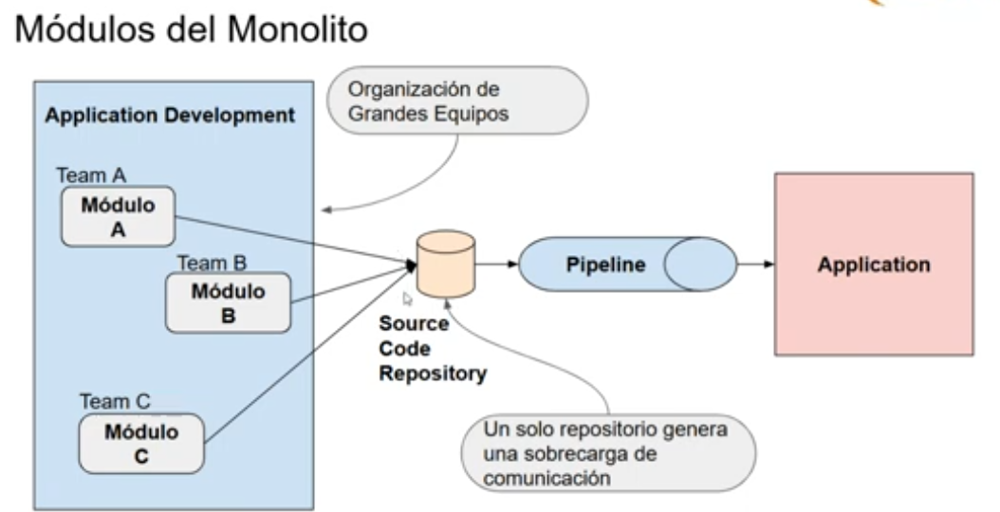

# Patrones de arquitectura - Clase 5: Autenticación y autorización con JWT - Pasando de monolito a microservicios

> Referencia: [Video de Youtube](https://www.youtube.com/watch?v=QtI4qKVWc_c&ab_channel=LuisMarianoBibb%C3%B3)
> Bibliografía mencionada: 
    - [JWT](https://jwt.io)-
    - _Microservices Patterns With Examples in Java_ , Chris Richardson
    - _Fundaments of Software Architecture: An Engineering Approach_, Mark Richards and Neal Ford 

## Autenticación y autorización

- **Autenticación**: verifica que dice que quién eres. (meidante login, http authentication, custom auth). 
- **Autorización**: verifica si se tienen permisos para acceder a un recurso (access control URLs, access control list).

### JWT (estándar)
Para la seguridad del sistema, se usa este estándar que define de forma compacta y autocontenida una forma de transmitir información json entre apps/pares/componentes. Permite que no se guarden en memoria el estado -> es un string en el que cada request está incrustado (es vigente por un determinado tiempo). 
Consiste en tres partes: 
- Header: tipo de jwt
- Payload: Claims -> información que contiene como el rol.
- Signature: Firma

Esto permite que el sistema pueda asignar roles a las personas para que el sistema maneje distintos permisos. 


## Monolito 
Se presentó anteriormente el sistema de capas del monolito. Éste es funcional para pequeños sistemas: permite hacer cambios estructurales fácilmente, fácil de escalar, facilita el testing y deploy. 


Sin embargo, luego acarrea problemas:
- overhead en la gestión: problemas al organizar los gruposde trabajo, los sprints. 
- dificultad para escalar: replicar 
- cada vez que el sistema va creciendo también crece la dificultad del dominio. 
- cada vez que se integraba para el pipeline una persona que conocía el dominio. 

A partir de esto se proponen diferentes arquitecturas para salir del monolito.

### Arquitectura hexagonal

En vez de tener capas se tiene al monolito con diferentes interfaces con los cuales interactua mediante puertos y con adaptadores para servicios externos.

```bash
src/main/java/
└── com.openmarket/                       # Paquete raíz
    └── core/                             # Capa de Dominio (Hexágono interno)
        ├── model/                        # Entidades, Value Objects, Agregados
        │   ├── Cart.java
        │   ├── Product.java
        │   ├── User.java
        │   └── ...                       # Otras entidades del diagrama
        ├── ports/                        # Puertos (Interfaces)
        │   ├── inbound/                  # Puertos de entrada (controlados por el dominio)
        │   │   ├── CartService.java      # Ej: interface para operaciones de carrito
        │   │   └── ProductService.java
        │   └── outbound/                 # Puertos de salida (implementados por adapters)
        │       ├── ProductRepository.java
        │       └── PaymentGateway.java   # Puerto para la pasarela de pagos
        └── services/                     # Lógica de negocio (implementa ports/inbound)
            ├── CartServiceImpl.java
            └── ...
    └── infrastructure/                  # Capa de Infraestructura (Adapters)
        └── adapters/
            └── outbound/
                └── persistence/

```
### Patron de Microservicio
Estructura la aplicación como una colección desacoplada e independientes de servicios deployables. 
En la cátedra se lo ve como varias arquitecturas hexagonal donde cada una tiene su base de datos. Cada uno tiene comunicación con el otro mediante APIs (usando adaptadores por ejemplo). Divide el dominio en subconjuntos de forma de construir algo lógico y que se comuniquen lo necesario. 


#### ¿Qué es un servicio?
Es un componente de software independiente que implementa una funcionalidad útil. Genera software más chico, más fácil de reusar, más fácil de testear.
Ventajas:
- Facilita el delivery continuo: cada módulo tiene un repositorio diferente, diferente pipeline. Hay independencia del ciclo de vida de la aplicación. 
- Servicios pequeños y fáciles de mantener. 
- Servicios se despliegan independientemente.
- Sericios escalan de forma independiente, facilita adoptar nuevas tecnologías 
- Facilita la division del trabajo


 
#### ¿Cuándo adoptar microservicios?
Es momento de cambiar cuando la aplicación es difícil de entender, mantener y testear, cuando el escalamiento cada vez se complejiza más.

Sin embargo, se tienen desventajas: 
- Encontrar cómo dividir el monolito. 
- Complejidad de los sistemas distribuidos (más servidores, manejo de transacciones más complejos, test automatizados más complejos). 
- Dificultad para desplegar funcionalidad que involucra múltiples servicios puede requerir mucha coordinación. 

### Estrategias para dividir el monolito
1. **División por dominio**
Identificación de los distintos dominios o subdominios del negocio y la agrupación de las funcionalidades relacionadas en un servicio independiente. Ayuda a crear servicios más cohesivos y con responsabilidad claramente definidas. 
2. **División por funcionalidad**
Se agrupan las funcionalidades relacionadas en un servicio independiente, independientemente del dominio. 
3. **Divisón por equipo**
Identificar los equipos que ya existen en la organización y asignarles servicios independientes. 
4. **División por datos**
Es en función de los datos que maneja. Puede ser útil si ciertos datos deben ser aislados y asegurados para cumplir con ciertas regulación o políticas de privacidad. 